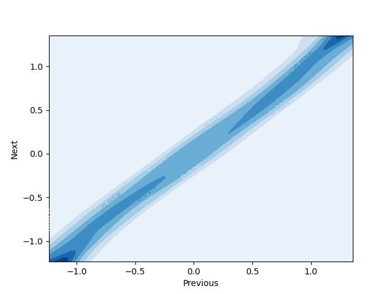
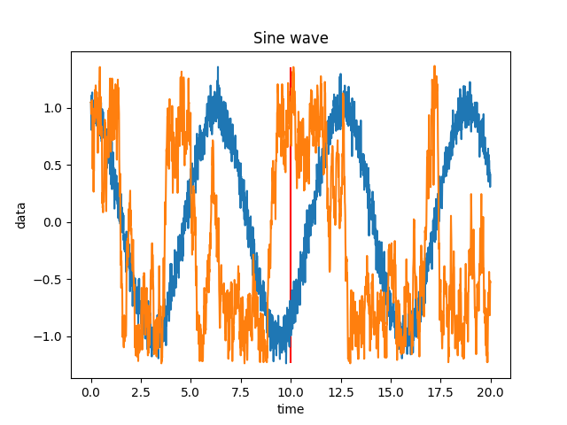
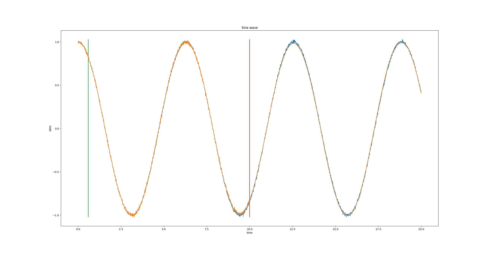

# HdCMM

A novel high dimensional continuous Markov chain predictor created by [me](https://github.com/maximkha). 

Unlike [continuous time Markov chains](https://en.wikipedia.org/wiki/Continuous-time_Markov_chain), which only interpolate between states, the continuous Markov chain uses [KDEs](https://en.wikipedia.org/wiki/Kernel_density_estimation) to create a high dimensional function that probabilistically maps previous variable values to future variable values. Notably the variable is continuous, there are not multiple discrete states.

## Explanation

The core idea is that we can create a function `P(x, y)` that gives us the probability that `y` is the current value given that `x` was the previous value.

Contour map of P function for sinewave:



I used a sinewave to test this method, however with a 2d P function the accuracy is terrible because the direction of the sinewave cannot be inferred. To predict the next the next 

Predicting the next point only using the previous point:



*Orange: Predicted, Blue: Actual with noise. The red line is how much of the blue data the algorithm used to construct the P function.*


Using a 3d P function doesn’t fair much better. This is because every point has an error, and the timestep is small (which also means that the change of the sinewave value is small) and the random noise injected can overpower the 2 point trend indicating which way the next prediction should head. However, using a large number of dimensions (aka more previous points) will create a good indicator of the next point.

Predicting the next point given 50 previously predicted points:



*Orange: Predicted, Blue: Actual with noise. The red line is how much of the blue data the algorithm used to construct the P function. The green line is the amount of data handed to the algorithm to ‘prime‘ it, this is the only time it is allowed to look at the actual, except for when constructing the P function. This is necessary because the P function needs 50 points to predict the next point.*

If we continued this plot over time, the predicted values and real values would slowly fall out of phase because the peaks would be slightly miss predicted, or more accurately, the period of the wave would have some error. 

## Code

First import NDMM

```python
from NDMM import NDMM
```

Next, create a predictor.

NDMM has 3 arguments:

1. Quant (.005), the step size used to sample the KDE. This is the smallest difference that the predictor can predict.
2. Bandwidth (.666), the width of the KDE peaks.
3. N (50), the number of previous values used to predict the next one

```python
predictor = NDMM(.005, .666, 50)
```

Finally you can predict the next value using either the `predictor.Step(<previous points>)` function or the `predictor.MaxProb(<previous points>)` function.

```
nextPoint = predictor.MaxProb(lastPoints)
```

The `Step` function randomly samples the distribution, while the `MaxProb` function returns the value with the highest probability.